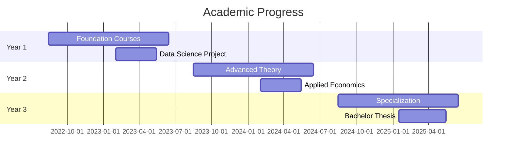

# 🎓 UiT Bachelor Portfolio

[](https://danieljoha.github.io/Uit-Bachelor-Portfolio)
[](https://uit.no)
[](https://uit.no)
[](https://github.com/Danieljoha/Uit-Bachelor-Portfolio)

> 📚 A comprehensive collection of academic work from my Bachelor's degree in Economics at UiT - The Arctic University of Norway

## 📖 Table of Contents

- [🎯 Overview](#-overview)
- [📋 Contents](#-contents)
- [🏗️ Structure](#-structure)
- [🔬 Key Projects](#-key-projects)
- [💻 Technology Stack](#-technology-stack)
- [🗓️ Academic Timeline](#-academic-timeline)
- [🚀 Usage](#-usage)
- [📈 Learning Outcomes](#-learning-outcomes)

## 🎯 Overview

This repository showcases **three years of academic excellence** in Economics, featuring coursework that demonstrates proficiency in:
- **Data Science & Analytics** using R and Python
- **Economic Theory & Application** 
- **Statistical Analysis & Modeling**
- **Research Methods & Academic Writing**

The portfolio includes regular assignments, comprehensive portfolio projects (mappeoppgaver), and a **Bachelor's thesis**, serving as a complete archive of my undergraduate academic journey.

## 📋 Contents

| Type | Description | Norwegian Term |
|------|-------------|----------------|
| 📝 **Assignments** | Regular course assignments completed individually or in groups | Innleveringer |
| 📊 **Portfolio Projects** | Comprehensive assignments demonstrating learning progress across courses | Mappeoppgaver |
| 🎓 **Final Exams** | Submitted final exam projects, reports, and solutions | Prosjektoppgaver |
| 📖 **Bachelor Thesis** | Final capstone research project | Bacheloroppgave |

## 🏗️ Structure

The repository follows a **chronological academic organization**:

```
📁 Uit-Bachelor-Portfolio/
├── 📂 Year 1/
│   ├── 📂 Semester 1/
│   │   ├── 📊 SOK-1003 (Microeconomics)
│   │   └── 📈 SOK-1004 (Macroeconomics)
│   └── 📂 Semester 2/
│       ├── 🔢 SOK-1016 (Mathematics for Economists)
│       ├── 💻 SOK-1005 (Data Science for Economists)
│       └── 📊 SOK-1006 (Statistics)
├── 📂 Year 2/
│   ├── 📂 Semester 1/
│   │   ├── 📊 SOK-2008 (Advanced Microeconomics)
│   │   └── 📈 SOK-2009 (Advanced Macroeconomics)
│   └── 📂 Semester 2/
│       ├── 🌍 SOK-2011 (Environmental Economics)
│       ├── 💼 SOK-2012 (Business Economics)
│       └── 🎯 SOK-2030 (Applied Economics)
└── 📂 Year 3/
    ├── 📂 Semester 1/
    │   ├── 🔍 SOK-2013 (Econometrics)
    │   └── 📊 SOK-2014 (Economic Analysis)
    └── 📂 Semester 2/
        ├── 🎓 Bachelor Thesis (SOK-2209)
        └── 📁 Additional Projects
```

## 🔬 Key Projects

### 🌟 Featured Work

| Course | Project | Description | Tech Stack |
|--------|---------|-------------|------------|
| **SOK-1005** | [Data Science Project](Year%201/Semester%202/Sok-1005/Project/) | Comprehensive data analysis using global temperature data | R, Quarto, ggplot2 |
| **SOK-2209** | [Bachelor Thesis](Year%203/Semester%202/) | Final capstone research project | LaTeX, R, Advanced Analytics |
| **SOK-2030** | [Applied Economics](Year%202/Semester%202/SOK-2030/) | Real-world economic analysis and presentation | R, RevealJS |

### 📊 Notable Assignments

- **📈 Economic Modeling**: Advanced mathematical modeling in SOK-1016
- **🌡️ Climate Data Analysis**: Temperature trend analysis using R in SOK-1005
- **📊 Statistical Inference**: Comprehensive statistical projects in SOK-1006
- **🎯 Applied Research**: Industry analysis and economic forecasting

## 💻 Technology Stack

| Category | Technologies |
|----------|-------------|
| **Programming** |   |
| **Documentation** |   |
| **Data Visualization** |   |
| **Analysis** |   |

## 🗓️ Academic Timeline



## 🚀 Usage

### 🌐 GitHub Pages
Visit the live portfolio: **[danieljoha.github.io/Uit-Bachelor-Portfolio](https://danieljoha.github.io/Uit-Bachelor-Portfolio)**

### 📖 Academic Reference
- **Students**: Browse for inspiration and methodology examples
- **Educators**: Review for curriculum and assessment ideas  
- **Employers**: Assess technical and analytical capabilities

### ⚠️ Important Notice
> **Academic Integrity**: These materials are shared for reference and inspiration only. 
> Do not copy or submit any content as your own work.

## 📈 Learning Outcomes

Through this academic journey, I have developed expertise in:

- **📊 Quantitative Analysis**: Advanced statistical methods and econometric techniques
- **💻 Programming Proficiency**: R, Python, and various data science libraries
- **📝 Research Skills**: Academic writing, literature review, and methodology design
- **🎯 Applied Economics**: Real-world problem solving and policy analysis
- **📈 Data Visualization**: Creating compelling and informative graphics
- **🔍 Critical Thinking**: Analytical reasoning and evidence-based conclusions

---

<div align="center">

**🎓 UiT - The Arctic University of Norway**  
*Faculty of Biosciences, Fisheries and Economics*

[](https://github.com/Danieljoha)
[](https://danieljoha.github.io/Uit-Bachelor-Portfolio)

</div>
